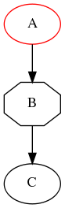

Introduction
============

This is a small Java library for creating
`Graphviz <http://graphviz.org>`_ graphs.

Example
=======

This example code::

  DiGraph g = new DiGraph("Example");            
                                                 
  Node a = g.addNode("A");                       
  Node b = g.addNode("B");                       
  // add edge using node objects:                
  g.addEdge(a, b);                               
                                                 
  g.addNode("C");                                
  // add edge using node names:                  
  g.addEdge("B", "C");                           
                                                 
  // set attribute using a type-safe setter:     
  a.addAttributeList()                           
          .setColor(Color.RED);                  
                                                 
  // set attribute using a generic string option:
  b.addAttributeList()                           
          .setUnquoted("shape", "octagon");      
                                                 
  File outputDir = new File("/tmp");             
  g.makeImageFile(outputDir, "png");

will produce the following graph:

Warning
=======

There are no type-safe setters for each attribute in Graphviz, because
there are just too many attributes. So the current list is just the
list that I need. Pull requests to extend this are very welcome!

License
=======

This software is licensed under the `Apache 2.0 license
<http://www.apache.org/licenses/LICENSE-2.0.html>`_.

